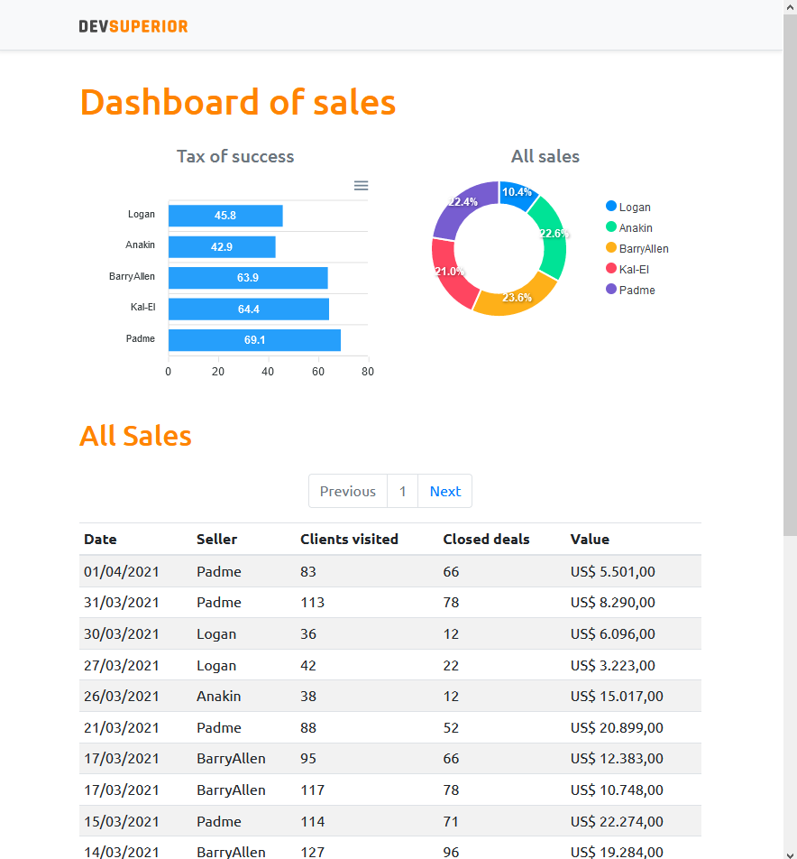

<h1 align="center">
<br>
  
<br>

<br>

DSVendas
</h1>

<p align="center">DSVendas is a web application to Analyze your sales performance from different perspectives.</p>

<p align="center">
  <a href="https://opensource.org/licenses/MIT">
    
  </a>
</p>

<div style="display: flex; justify-content: space-between;">

  
  
  
</div>


----

## Features

This webpage all the latest tools and practices in web development!

- 📘 **React Js** — A JavaScript library for building user interfaces.
- 📓 **Typescript** — TypeScript is an open-source language which builds on JavaScript, one of the world’s most used tools, by adding static type definitions..
- 📙 **Axios** — Promise based HTTP client for the browser and node.js.
- 📕 **Html** — HTML is the standard markup language for Web pages.
- 📗 **Apexcharts** — ApexCharts is a a free and open-source modern charting library that helps developers to create beautiful and interactive visualizations for web pages.
- 📘 **bootstrap** — Bootstrap is an open source web framework for developing interface and front-end .


<table>
<thead>

## Getting Started 
 
First, run the development project:

```bash
npm run dev
# or
yarn dev
```

1. Open [http://localhost:3000](http://localhost:3000/episodes) with your browser to see the project.


## License

<div style="text-align: center;">

This project is licensed under the MIT License - see the [LICENSE](https://opensource.org/licenses/MIT) page for details.

</div>